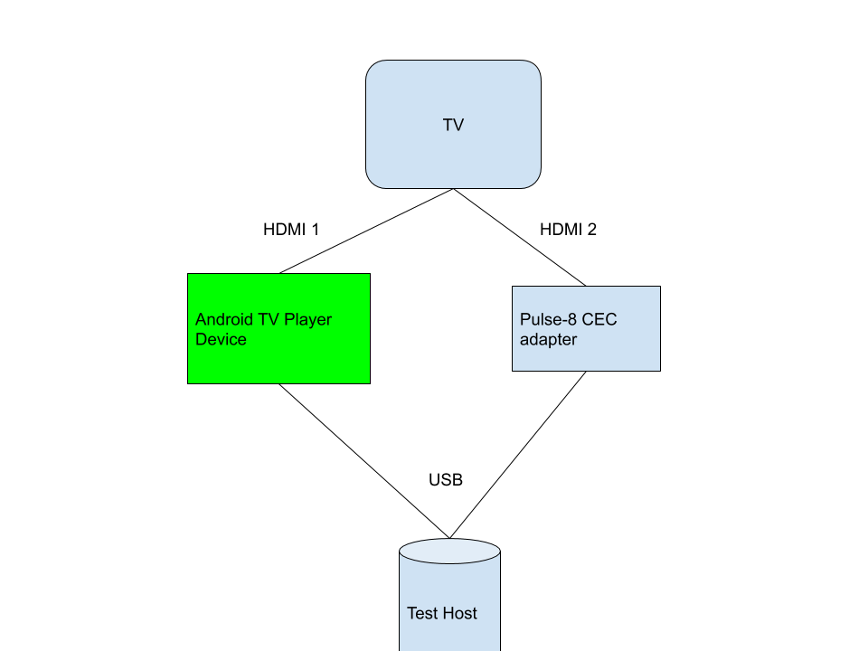

# CEC CTS testing for Android TV devices

NOTE: CTS has two meanings here. HDMI defines a set of tests in the
**Compliance Test Specification** of HDMI 1.4b
__HDMI Compliance Test Specification 1.4b__ and
**Android Compatibility Test Suite**.

The Android Compatibility Test Suite includes specific tests from the HDMI
Compliance Test Specification as well as other Android specific tests.

## Setup

### Playback devices (aka Set Top Boxes)

Running these CTS tests requires a specific HDMI layout with a CEC adapter.

*   Android TV playback device
*   CEC adapter, see [External CEC Adapter instructions](cec_adapter.md)
*   Install `cec-client` binary, see [install instructions](cec_adapter.md#software)
*   HDMI Display (aka a TV) with CEC disabled to avoid interference, or an HDMI fake plug

It is recommended that the playback device has an HDMI physical address of `1.0.0.0` while running
the tests. In case the DUT takes a physical address other than `1.0.0.0` and this is unavoidable,
the tests can be configured to expect a different physical address by appending these arguments to
the tradefed command:
```
--module-arg CtsHdmiCecHostTestCases:set-option:cec-phy-addr:<address_in_decimal>
```
Thus, for a device that is taking an address `3.0.0.0`, pass `12288` as the `cec-phy-addr` argument.

The CEC adapter may also be installed in-between the TV and the playback device.



### TV panel devices

Running these CTS tests on TV panel devices requires an external CEC adapter.

*   Android TV panel device
*   CEC adapter, see [External CEC Adapter instructions](cec_adapter.md)
*   Install `cec-client` binary, see [install instructions](cec_adapter.md#software)

It is recommended to connect the CEC adapter to the HDMI ARC port of the TV device.

### Automation

Given the setup described above you can run this test module with the following commands:

#### cts-tradefed

```
cts-tradefed > run cts -m CtsHdmiCecHostTestCases
```

#### atest
```
atest CtsHdmiCecHostTestCases
```

To shard the test (distribute and run the tests on multiple devices), use this
command -
```
./cts-tradefed run commandAndExit cts --enable-token-sharding --shard-count 3 -m CtsHdmiCecHostTestCases
```

The shard count corresponds to the number of DUTs connected to the host.
