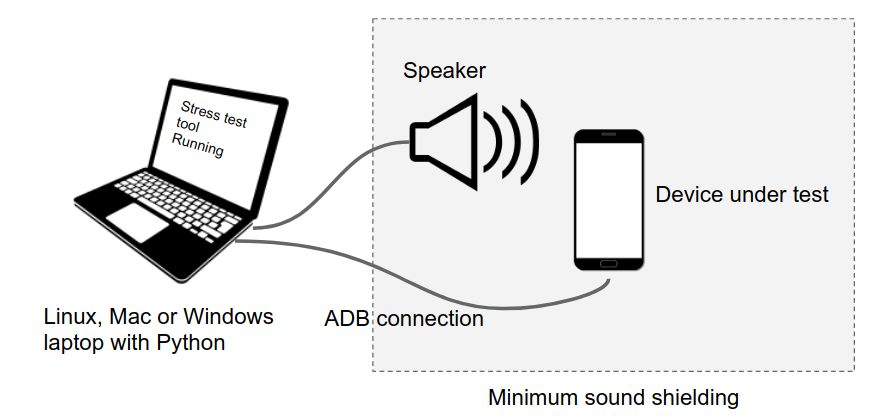

# OpenHST : Open sourced Hotword Stress Test tool

Hotword stress test tool is a python script to measure the Google Hotword
performance on Android devices with simple test set up. The goal of OpenHST is
making Google Hotword Stress Test tool as an open source project so that Android
Partners can easily adapt on their development.

## Overview

## Prerequsite

Before setting up your HST test environment, please make sure to meet following
preconditions.

*   DSP hotword capability on test device (android handset)
*   ADB connection between the test server and android handset
*   Internet connection on android handset
*   No screen lock setting on android handset
*   Install Homebrew (Mac)
*   Install [pyenv](https://github.com/pyenv/pyenv#installation) for Linux and Mac.
*   Install GNU make(3.81 above) on test machine (Linux, Mac, Windows)

## Test environment setup

Please follow below steps to set up HST on your test machine and make sure that
no error popped up during the installation.

__Linux & Mac__

1.  pyenv install 3.6.8
1.  pyenv shell 3.6.8
1.  make start
1.  chmod +x ./start_venv.sh
1.  source env/bin/activate
1.  ./start_venv.sh
1.  make proto-compile

__Windows__

1.  install python3.7.5
1.  make start
1.  .\env\Scripts\activate
1.  pip3 install -r requirements.txt
1.  Download [protoc.ext (3.11.4 version)](https://github.com/protocolbuffers/protobuf/releases/download/v3.11.4/protoc-3.11.4-win64.zip) from [github](https://github.com/protocolbuffers/protobuf/releases/tag/v3.11.4)
1.  Decompress protoc-3.11.4-win64.zip and copy bin/protoc.exe to env/ folder
1.  Decompress protoc-3.11.4-win64.zip and copy include/* under env/include folder
1.  make proto-compile

## Voice model training

Before conducting stress test, voice model should be trained with the recorded tts sound.

1.  Please follow the guide in "Train voice model" chapter in [OEM Hotword Stress Test with OpenHST](https://docs.google.com/presentation/d/e/2PACX-1vR5kjJfMZGMLMeyFV3AmzgGT1gniS1URztYqv4IJleWiSAtDNYNodsF1FMJHT57duP8CPr5oXvEEqCb/pub?start=false&loop=false&delayms=3000)

## Stress Test

Please refer to the guide in "Run Stress Test" chapter in  [OEM Hotword Stress Test with OpenHST](https://docs.google.com/presentation/d/e/2PACX-1vR5kjJfMZGMLMeyFV3AmzgGT1gniS1URztYqv4IJleWiSAtDNYNodsF1FMJHT57duP8CPr5oXvEEqCb/pub?start=false&loop=false&delayms=3000) and run the hotword stress test.

1.  python stress_test.py --test_name dsp_trigger_and_screen_off --num_iterations 3000 --output_root test_out
1.  Over 95% pass ratio from 3000 test cycle would be fair enough to declare that the device passed the hotowrd stress test

## Contacts

Join our [mailing list](https://groups.google.com/g/openhst) for discussions and
announcements.
