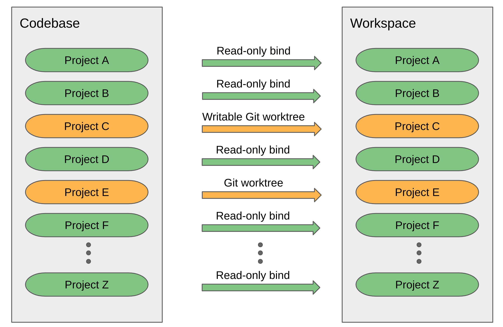

# hacksaw

**HACK** in a **S**peedy **A**ccess **W**orkspace

## What is Hacksaw?

If you have a large multi-gigabyte codebase spread out through multiple git projects it can take a long time branch off a clean workspace. Hacksaw is a tool that
lets you split off a clean workspace in seconds. It does so by only copying git projects that you
explicitly select to be edited. All other projects are read-only bind mounts. This lets you build without cloning the full codebase to a new location!

## How much faster is it, really?

Lets look at some performance numbers for creating a hacksaw workspace using as a codebase the AOSP master branch as of 2020-8-4. The machine used was a c2-standard-60 Google Cloud Platform VM with 60 vCPUs and 240 GiB of RAM. Each action was performed at least 10 times then averaged out.

* Create a new Hacksaw workspace
  + Time: 0.4 sec
  + Disk usage: 7.9 MiB

* Remove a Hacksaw workspace with no edits or build artifacts.
  + Time: 0.6 sec

* Create a new Hacksaw workspace and edit build/make project.
  + Time: 0.6 sec
  + Disk usage: 18 MiB

* Create a new Hacksaw workspace and edit frameworks/base project.
  + Time: 7.5 sec
  + Disk usage: 1.3 GiB

As you can see, the time it takes to set up a new hacksaw workspace is proportional to
the git projects checked out for editing. Contrast that with how long it takes
to create a workspace using a full repo sync with a local
mirror.

* Create a new full repo workspace [using a fresh local mirror](https://source.android.com/setup/build/downloading#using-a-local-mirror)
  + Time: 12 min 32 sec
  + Disk usage: 88 GiB

* Remove a full repo workspace with no build artifacts
  + Time: 28 seconds

## Can you give me an example?

```
$ mkdir ~/aosp
$ cd ~/aosp
$ repo init -u https://android.googlesource.com/platform/manifest
...
$ repo sync --quiet --current-branch --no-tags --no-clone-bundle --jobs=$(nproc)
...
$ hacksaw codebase add aosp ~/aosp
Added codebase aosp
$ hacksaw codebase default aosp
Default codebase set to aosp
$ hacksaw workspace new big-feature
Composing.................................................................
..........................................................................
..........................................................................
..........................................................................
..........................................................................
..........................................................................
..........................................................................
..........................................................................
..........................................................................
..........................................................................
..........................................................................
...........................................
Workspace composed
Created big-feature at ~/hacksaw/big-feature
$ hacksaw edit ~/hacksaw/big-feature/tools/treble
Created branch big-feature on project ~/hacksaw/big-feature/tools/treble
$ hacksaw workspace new quick-fix
Composing.................................................................
..........................................................................
..........................................................................
..........................................................................
..........................................................................
..........................................................................
..........................................................................
..........................................................................
..........................................................................
..........................................................................
..........................................................................
...........................................
Workspace composed
Created big-feature at ~/hacksaw/quick-fix
$ hacksaw edit ~/hacksaw/quick-fix/tools/treble
Created branch quick-fix on project ~/hacksaw/quick-fix/tools/treble
```

## How do I install it?

Building hacksaw requires [golang to be installed](https://golang.org/doc/install).
To install the hacksaw client run the following:

```
go get android.googlesource.com/platform/tools/treble.git/hacksaw/cmd/hacksaw
```

This will install hacksaw to ~/go/bin/hacksaw. You may choose to copy that
to a location in your path. For example:

```
sudo cp ~/go/bin/hacksaw /usr/local/bin
sudo chmod 755 /usr/local/bin/hacksaw
```

## How do I make sure that creating a hacksaw workspace is fast?

Hacksaw creates bind mounts for all git projects in a codebase. It then
copies **everything** else. Make sure you remove all build artifacts from a
codebase before create a workspace, otherwise it may spend a long time copying
them.

## How do I run it with sudo?

Commands that mount and unmount will require sudo. That includes commands like

* `hacksaw workspace new`
* `hacksaw edit`
* `hacksaw workspace remove`

Other commmands like `hacksaw workspace list` or `hacksaw add codebase` do not
mount or unmount so do not require sudo.

If you would like to avoid using sudo you may install hacksawd as explained below.

## How do I run it without sudo?

Hacksawd is a privileged system daemon whose only job is to manage bind mounts.
The provided install script will install to your system

```
go get android.googlesource.com/platform/tools/treble.git/hacksaw/cmd/hacksawd
sudo cp ~/go/bin/hacksawd /usr/local/bin
sudo chmod 755 /usr/local/bin/hacksawd
sudo ~/go/src/android.googlesource.com/platform/tools/treble.git/hacksaw/scripts/install-service.sh
```

The installation scripts creates a new "hacksaw" group and adds you to it. You
will need to log out and log back in for the group changes to take effect. After that you should be able to run any hacksaw command without sudo.

If you wish to uninstall the service then run:

```
sudo ~/go/src/android.googlesource.com/platform/tools/treble.git/hacksaw/scripts/uninstall-service.sh
sudo rm /usr/local/bin/hacksawd
```
## How do I sync?

You sync your codebases using `repo sync`. All updates will be propagated to workspaces.
Except for projects that you are currently editing. Those will require you to `git pull`
manually in the workspace project.

## How does hacksaw work?

Hacksaw uses read-only bind mounts to create project references from
a workspace to a codebase. When you mark a project for editing then
its read-only bind mount gets replaced by a writable Git worktree.




## What are the known issues?

* Some repo commands don't work yet. Namely: `repo start` and `repo upload`.
  So at the moment you can only upload to Gerrit [using git
  push](https://gerrit-review.googlesource.com/Documentation/user-upload.html#_git_push).
* Failing to create a workspace is not rolled back.
* Editing nested projects is not supported yet. So if you have a git project
  that contains other git projects you will get some unexpected behaviour.
* Git submodules are not supported yet, but the tool is designed with
  future git submodule support in mind.
* Syncing a codebase does update the existing projects in all attached
  workspaces but it does not remove or add new projects. Perhaps there
  should be a new "workspace sync" command for that?

## Where can I get more help?

You can ask hacksaw-users@googlegroups.com by [joining the group](https://groups.google.com/forum/#!forum/hacksaw-users).